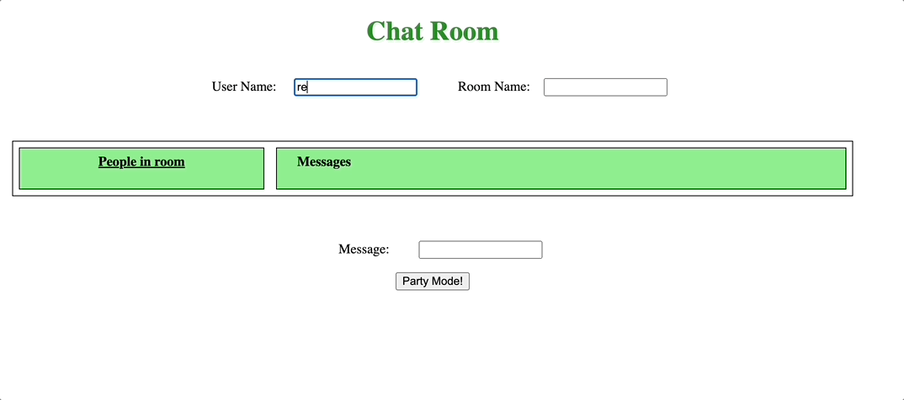

# Slack Clone Chat App

## Overview

Developed a Slack clone chat application that allows users to join chat rooms and send messages in real-time. This project showcases full-stack development skills, with frontend components built using HTML, CSS, and JavaScript, and backend components developed in Java to handle communication over WebSockets. As part of this project, a custom web server was also implemented in Java.

## Demo



### Features:
- Real-time messaging in chat rooms.
- Users can join different chat rooms.
- Fully developed web server to manage communication.

## Installation and Setup

### Prerequisites

- **Java Development Kit (JDK)** (version 11 or higher)
- **Web Browser** for accessing the chat application

Ensure you have the JDK installed on your system. You can download it from the [Oracle JDK official website]([https://cmake.org/download/](https://www.oracle.com/java/technologies/downloads/#java11)).

### Building and Running the Project

#### Using the Command Line

1. **Clone the repository:**

   ```sh
   git clone https://github.com/reshmar00/ChatServer.git
   cd ChatServer

2. **Compile the Java source files:**

   ```sh
    javac -cp ./src:./lib/json-simple-1.1.1.jar ./src/Server.java

3. **Run the server:**

   ```sh
    java -cp ./src:./lib/json-simple-1.1.1.jar Server

4. **Access the application:**

&nbsp;&nbsp;&nbsp; After running the server, it will print the localhost port number and the HTML file to access the app. Open your web browser and navigate to the provided URL, typically `http://localhost:8080`.
  
#### Using IntelliJ IDEA (or some other IDE)


1. **Clone the repository:**

   ```sh
   git clone https://github.com/reshmar00/ChatServer.git
   cd ChatServer

2. **Open the project in IntelliJ IDEA:**
- Open IntelliJ IDEA and select `File > Open`.
- Navigate to the cloned repository directory and open it.

3. **Run the server:**

- Locate `Server.java` in the `src` directory.
- Right-click `Server.java` and run it.

3. Access the application:

- After running the server, it will print the localhost port number and the URL to access the app. Open your web browser and navigate to the provided URL, typically `http://localhost:8080`.

## Additional Information
### Project Structure

- **resources/**: Directory containing HTML, CSS, and JavaScript files.
  - **chat.html**: Frontend HTML file for the chat application.
  - **style.css**: Stylesheet for the frontend.
  - **script.js**: JavaScript file for frontend logic.
- **lib/**: Directory containing library files.
  - **json-simple-1.1.1.jar**: JSON library used in the project.
- **src/**: Directory containing the Java source files.
  - **Server.java**: Main server file.
  - **WSResponse.java**: Handles WebSocket responses.
- **chatServerDemo.gif**: Demo of the application in action.

### Web Server Details
The custom web server developed in Java handles WebSocket communication, allowing for real-time messaging functionality. It serves the `chat.html` file and manages different chat rooms, enabling users to join and participate in conversations seamlessly.

### Accessing the Chat Application
Once the server is running, it will display the localhost port number and the URL to access the chat application. For example:

```
Server started and listening on port 8080
Access your HTML file at: http://127.0.0.1:8080/chat.html
```

Open the URL in your web browser to start using the chat application.


Feel free to reach out if you have any questions or need further assistance. Enjoy the chat application!
